# Handheld3DScanner
A structured-light-based Stereo Vision System

This repo is used as a record of developing a Handheld3DScanner at 27th Fengru Cup, a Tech Competition at Beihang University in Beijing, China in 2017. 

Techniques used:
   - Algorithms/Models: (2+1) Phase-Shift Method, Digital Speckle Projection Method
   - Frameworks/Libraries: OpenCV, SolidWorks
   - Languages: C++

Highlights：
This project proposed to combine the (2+1) phase-shift method and digital speckle projection method for preliminary and precision image matching.

Important References are:
 [High-speed three-dimensional shape measurement system using a modified two-plus-one phase-shifting algorithm](https://engineering.purdue.edu/ZhangLab/publications/papers/2007-oe-2p1.pdf)
 [数字散斑投影和相位测量轮廓术相结合的三维数字成像方法](https://patents.google.com/patent/CN101608908A/zh)

 Codes related to the core idea of our optical 3D surface reconstruction algorithm is provided.

 You are welcome to contact [me](https://www.linkedin.com/in/yuhua-angela-ma-676a73184/) and ask any questions about this project.

More explanation:
##Abstract
Based on a binocular measurement system, our group uses the 2+1 phase shift method to calculate the phase value and find the corresponding point of the binocular camera by capturing the projected digital speckle structure light. Finally, the 3D point cloud information is solved by the triangle principle. The experimental results show that the proposed method is fast and accurate, and is suitable for handheld 3D scanner.

##keywords:Portable 3D scanner, 2+1 phase shifting, digital speckle projection, real-time 3D measurement

##Background Knowledge

You can check the first .5 hour of [this](https://www.youtube.com/watch?v=DsbG4XHA_m4) video for an introduction of 3D surface reconstruction.

The steps of solving a traditional 3d reconstruct problem is: get input image data, find corresponding points and reconstruct a point cloud using pin-hole model. Finding corresponding points is the most difficult step.

One of the most popular algorithms we use for feature points detection is Scale Invariant Feature Transform（SIFT )，which was invented by Professor David Lowe from UBC and published in 1999.

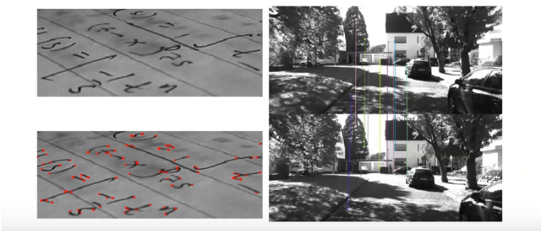

You can check SIFT's basic idea from [this](https://www.bilibili.com/video/av42629442/) link.

The main problem with using SIFT in 3d reconstruction, especially in precision measurement is that feature points are not dense enough, i.e. we cannot acquire enough corresponding points for reconstruction.

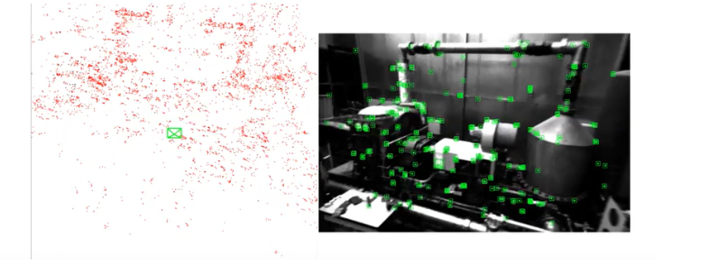

One solution is to use a structured light system(SLS) . In the binocular stereo vision system, in order to find the corresponding points,  each camera needs to project sin structure light to the Object with four different phase shift under three different frequent, which needs in total 2*3*4 = 24 fringe images. The calculation result is somehow beautiful, but the projection and capture time is a bit long for a handheld scanner, because our hand cannot hold still for a very long time. Therefore, we need a new algorithm that can further alleviate the error due to motion, i.e., spend less time on the projection process.

## Our algorithm

The stream of our system is:
Epipolar Rectification, which determines a transformation of each image plane such that all epipolar lines are parallel to the horizontal axis.
2+1 Phase Shift Implementation, which calculates the phase value.
Digital Speckle Projection, which finds the corresponding point of the input images.
Triangle Principle Implementation, which calculates 3D point cloud information.

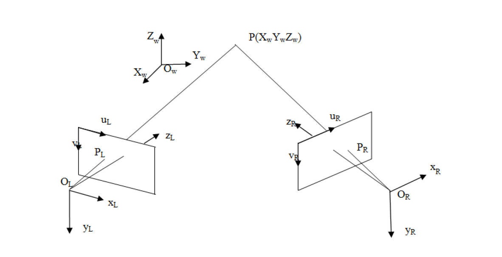

Binocular Stereo Vision Model

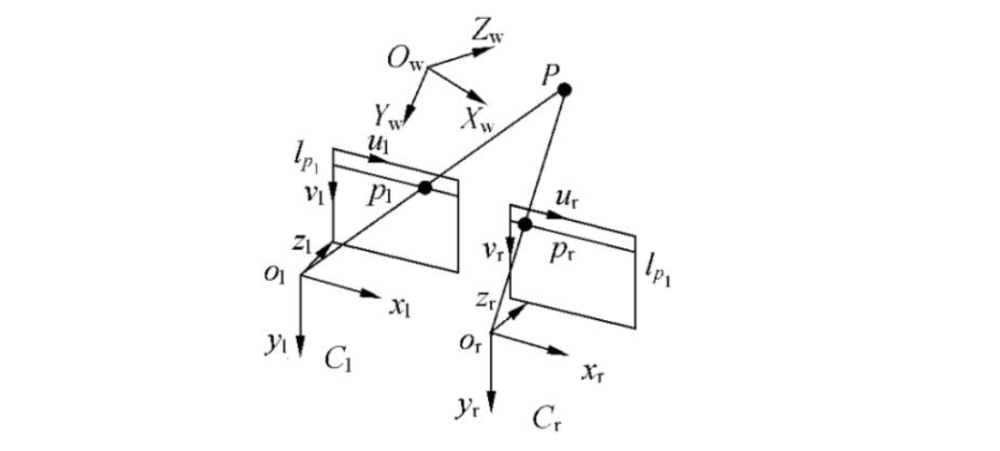

Epipolar Rectification Standard Geometric Model

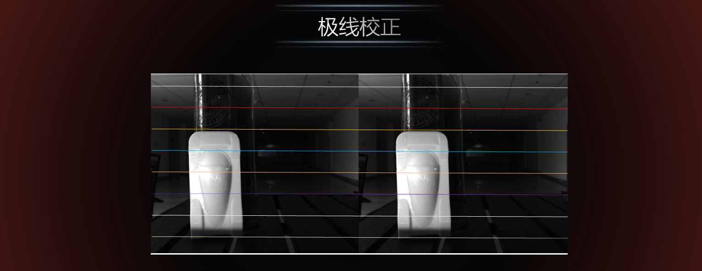

Epipolar Rectification Physical model

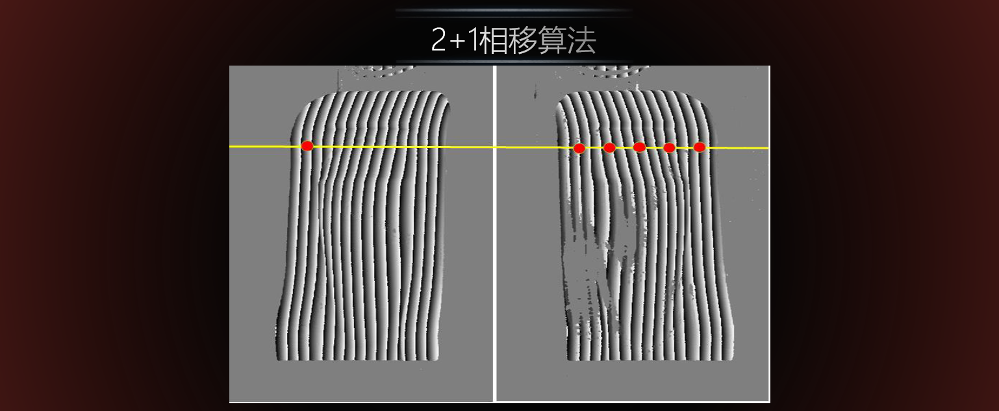

(2+1) Phase Shift Implementation

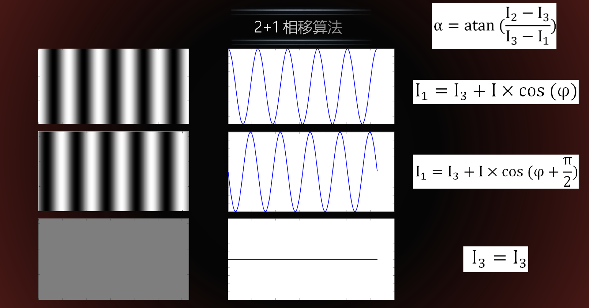

(2+1) Phase Shift Model

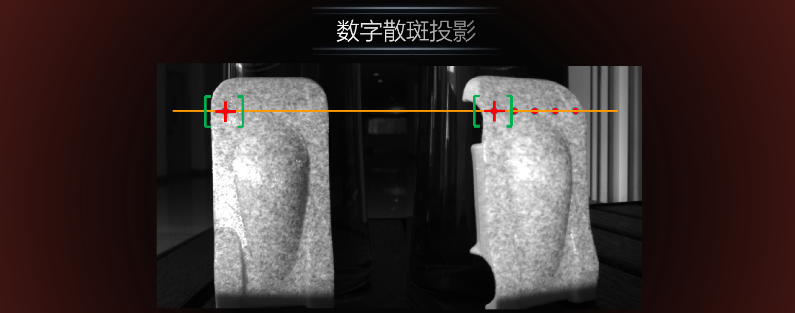

Digital Speckle Projection

NCC, which is the calculation function to judge corresponding points

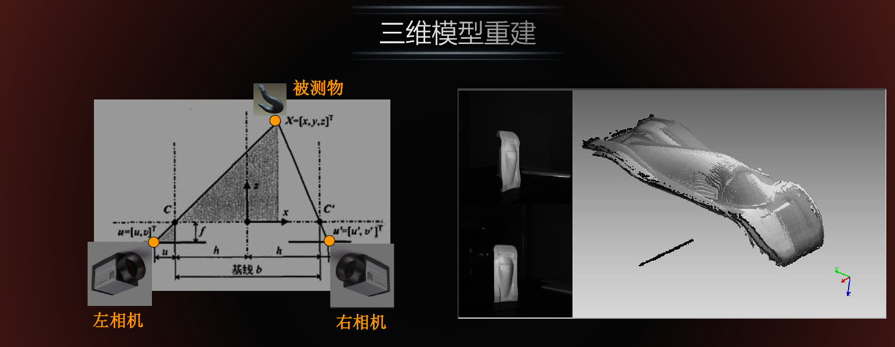

The Triangle Principle and reconstruction output display
## System Performance:

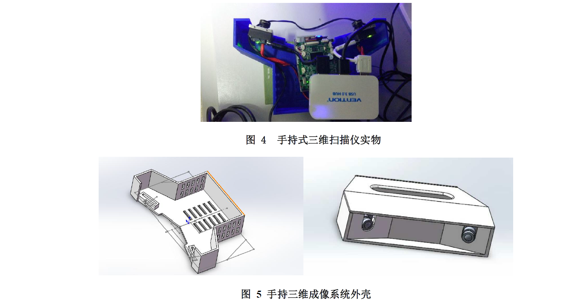

Our Cute Handheld 3d scanner!!

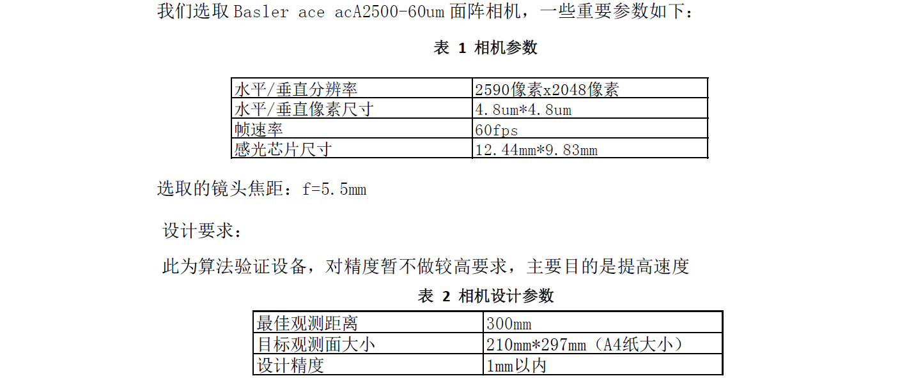

Our scanner’s camera parameters

A video of our scanner

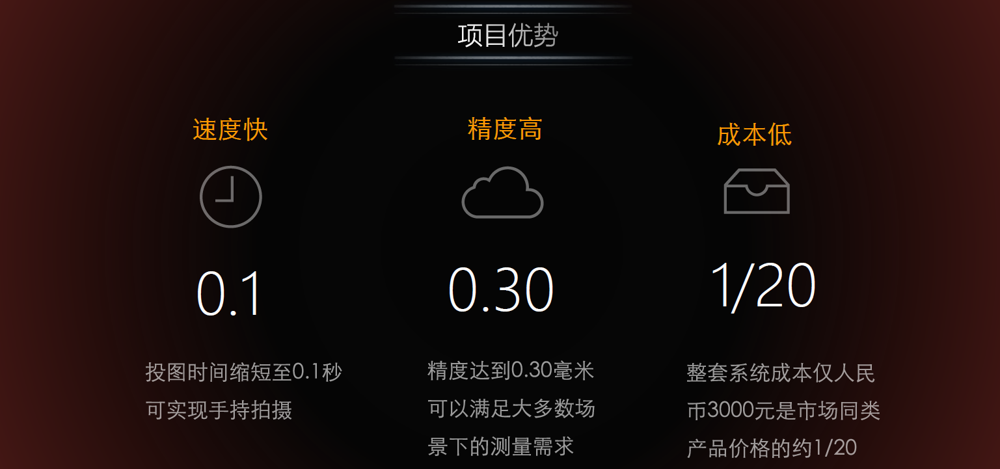

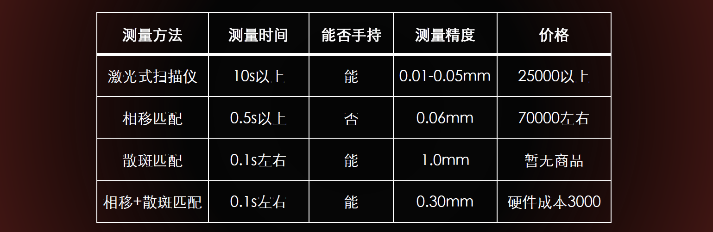

The performance of our scanner

Our project has won 2nd Prize in Fengru Cup Competition. You can check out our full report and presentation [here](google drive)

copyright
xiaoma1002
